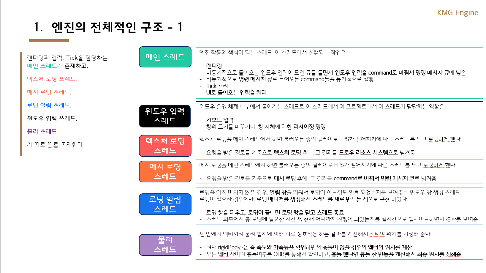
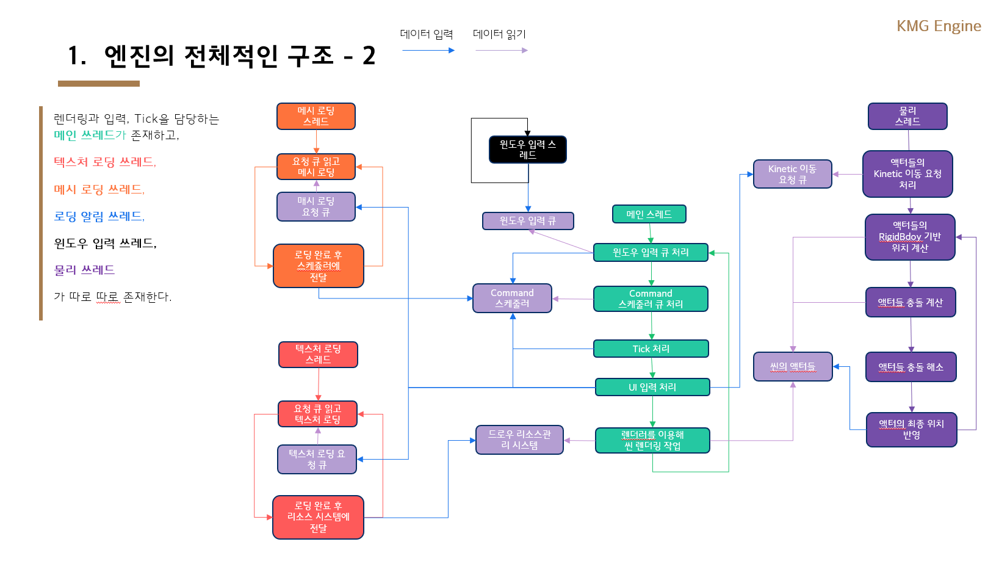

# 🎮 KMG Engine Architecture

## 📌 엔진 아키텍처 개요

  

---

## 🧠 아키텍처 설계 개요

- 본 엔진은 **스레드 간 동기화**를 핵심으로 고려하여 설계되었습니다.
- **IO 작업(텍스처/메시 로딩 등)** 또는 **고비용 연산**은 **메인 스레드 이전에 비동기 전용 스레드에서 선처리**되며, 최종 반영은 메인 스레드에서 일관되게 처리됩니다.
- 각 작업 스레드는 **작업 요청 큐**를 통해 명령을 받고, 결과는 **Command 객체**로 감싸져 **Command 스케줄러**에 전달됩니다.

### ✅ 구현된 전용 작업 스레드

- 🎨 텍스처 로딩 스레드
- 🧱 메시 로딩 스레드
- ⚙️ 물리 계산 스레드

### ⚠️ 입력 처리 주의사항

- IMGUI 특성상, **입력 처리는 렌더링 중에만 유효**하므로  
  → **UI 입력 처리와 렌더링은 메인 스레드에서 통합 처리**됩니다.
- 입력 처리를 별도 스레드에서 처리하면, **동기화 지연으로 인한 프레임 끊김**(race condition)이 발생할 수 있습니다.

---

## 🧪 물리 엔진 동작 및 동기화 전략

- 물리 엔진 스레드는 **모든 액터의 Transform 변경을 담당하는 유일한 책임**을 가집니다.
- 사용자가 Transform 변경을 요청하면, 해당 요청은 **큐에 저장**되고 물리 엔진 스레드가 이를 **큐에서 읽어 처리**합니다.
- **물리 엔진 스레드와 렌더링 스레드는 서로 다른 주기로 동작**하며, 이로 인해 동기화 방식이 매우 중요합니다.

---

## 🛡️ 물리 엔진에서 FPS 최적화를 위한 동기화 전략

### 1️⃣ Transform 더블 버퍼링

- `writeTransform`: 물리 스레드가 계속 갱신
- `readTransform`: 렌더 스레드가 계속 사용
- 렌더링 시작 시점에만 **mutex를 잠그고 write → read로 복사**  
  → 평소에는 스레드 간 대기 없이 높은 FPS 유지

### 2️⃣ Queue 더블 버퍼링

- 작업 요청 큐도 두 개로 분리:
  - 하나는 **쓰기 버퍼** (요청 입력 전용)
  - 다른 하나는 **읽기 버퍼** (실행 전용)
- 작업 실행 전 **버퍼를 swap**하며, 이 순간에만 mutex를 사용  
  → 큐 접근 대기 최소화

---

## ⚙️ 작업별 스레드 최적화 구조

### 🎨 메시 로딩 최적화

> 메시를 로딩하는 것은 IO 작업이기에 오래 걸리는데 어떻게 하지?

- 메시 처리 작업은 두 단계로 분리:
  1. **파일에서 메시 데이터를 읽는 작업** (IO 중심, 병목 발생)
  2. **읽은 메시 데이터를 액터에 적용하는 작업** (연산 중심)
- 따라서:
  - **파일 읽기**는 **전용 메시 로딩 스레드**에서 처리
  - **액터에 적용**은 **메인 스레드**에서 Command로 수행
- 이 구조는 **멀티스레드의 빠른 실행력**과 **렌더 동기화 안정성**을 동시에 확보함

### 🧱 텍스처 로딩 최적화

> 텍스처를 로딩하는 것도 IO 작업이기에 오래 걸리는데 어떻게 하지?

- 텍스처도 메시와 마찬가지로 두 단계로 분리:
  1. **파일에서 읽어오는 작업** (IO 중심)
  2. **드로우 리소스 시스템에 텍스처를 등록하는 작업** (GPU 리소스 접근)
- IO는 **텍스처 로딩 스레드**가 담당  
- GPU 등록은 **Command로 전달**, 메인 스레드에서 처리
- 동시에 사용할 수 있는 구조이므로 텍스처 교체/재사용에도 유연함
- **mutex를 최소화하여 성능을 보장**하는 구조로 설계됨

### 🖼️ 렌더링 커맨드 최적화

> 그림 리소스를 일일이 하나씩 준비하고 그리는 것은 시간이 많이 걸릴 것 같은데 시간을 줄일 수 있는 방법이 없을까?

- DirectX11에서는 **Deferred Context**를 통해 **멀티스레드로 CommandList를 생성 가능**
- 즉:
  - 렌더링 스레드들이 **CommandList**를 비동기 생성
  - 메인 스레드에서는 **생성된 List를 병합 및 실행**
- 이 구조를 통해 **Draw 호출 병목을 줄이고**, **MainContext는 실행에만 집중**할 수 있음
