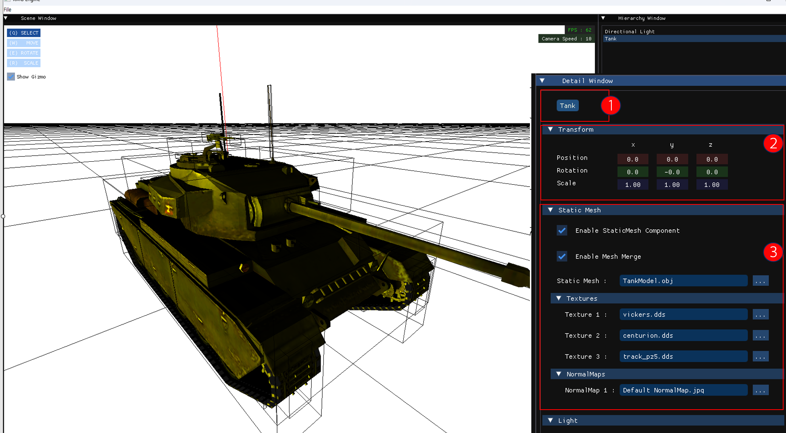
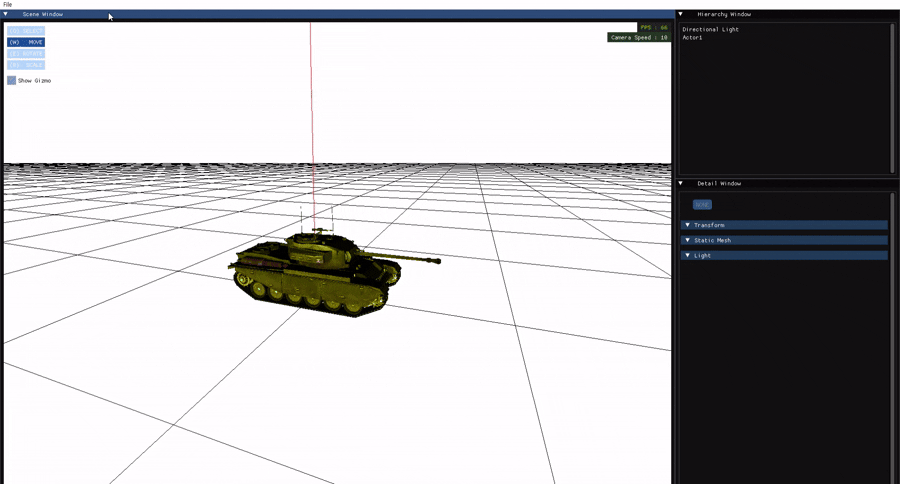
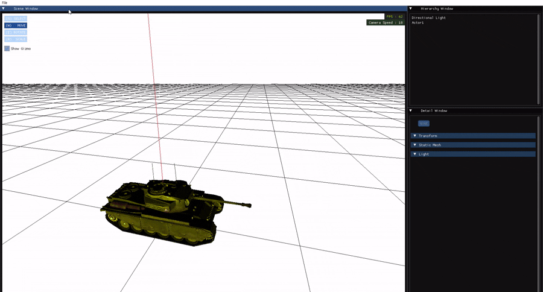
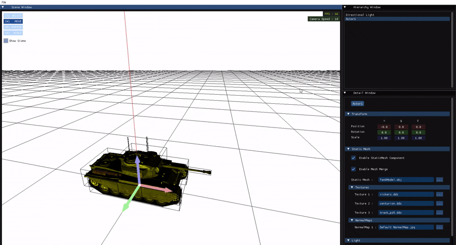
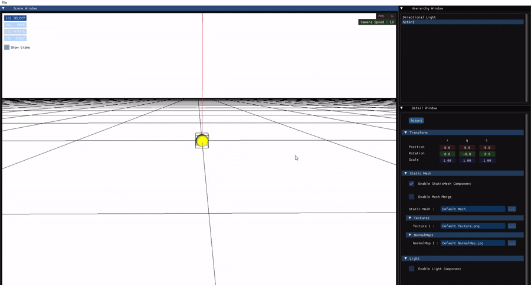
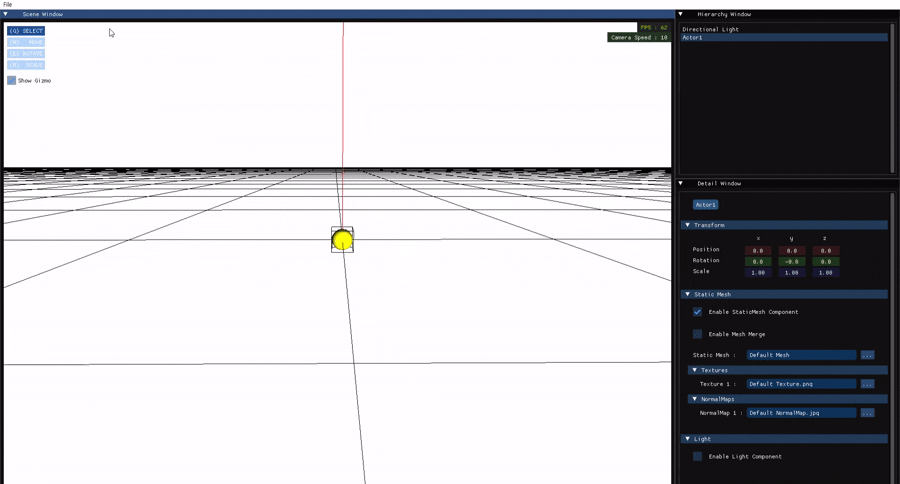
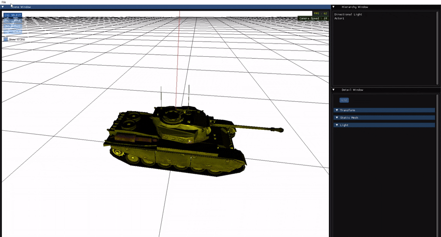
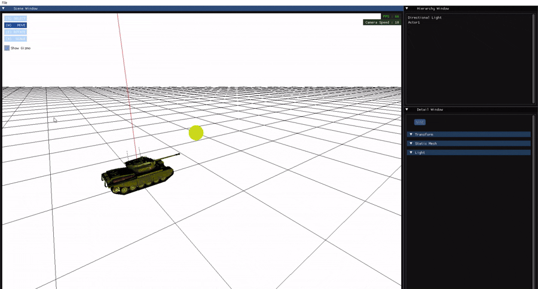
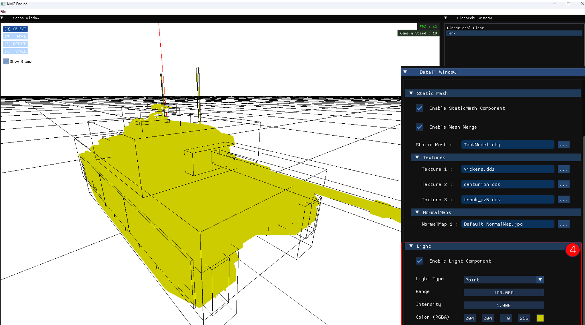

---
## 🧾 0️⃣ Detail Window

`Detail Window`는 현재 **선택한 액터(Actor)의 상세 정보**를 확인하고 수정할 수 있는 창입니다.

---

### 1️⃣ 액터 이름 표시

- 선택된 액터의 이름이 상단에 표시됩니다.
- 해당 액터가 **Invisible 상태**일 경우, 이름이 **회색**으로 표시되어 상태를 직관적으로 확인할 수 있습니다.

---

### 2️⃣ Transform 정보 수정

액터의 **Transform(Position, Rotation, Scale)** 값을 확인하고 수정할 수 있습니다.  
입력 필드에 직접 숫자를 입력하거나, 드래그하여 값을 조정할 수 있습니다.  
회전은 **오일러 각(Euler Angles)** 기준입니다.

| 항목 | 설명 | 이미지 |
|------|------|--------|
| 위치(Position) | X, Y, Z 위치 값 수정 |  |
| 회전(Rotation) | 오일러 각 기준으로 각 축 회전 |  |
| 스케일(Scale) | X, Y, Z 방향 크기 조절 |  |

---

### 3️⃣ Static Mesh Component 제어

액터가 가진 **Static Mesh Component**에 대해 다양한 설정이 가능합니다:

#### 🔘 Enable Static Mesh

- Static Mesh 사용 여부를 켜고 끌 수 있는 토글입니다.  
  

---

#### 🧱 Mesh Merge

- 액터에 포함된 여러 메시를 하나로 병합하여 렌더링합니다.  
- 각 메시가 따로 움직이지 않는다면 **최적화를 위해 병합 권장**  
  

---

#### 🔁 Set Mesh

- 현재 메시를 **다른 메시로 교체**합니다.  
- 메시에 **텍스처 정보가 포함**되어 있다면 텍스처도 자동으로 로드됩니다.  
  

---

#### 🎨 Set Texture

- 현재 메시의 텍스처를 **직접 선택하여 교체**합니다.  
  

---

### 4️⃣ Light Component 제어

`Detail Window`에서는 액터에 포함된 **Light Component**의 속성도 제어할 수 있습니다.  
조명 타입, 밝기, 색상 등 다양한 속성 값을 수정할 수 있습니다.

---

