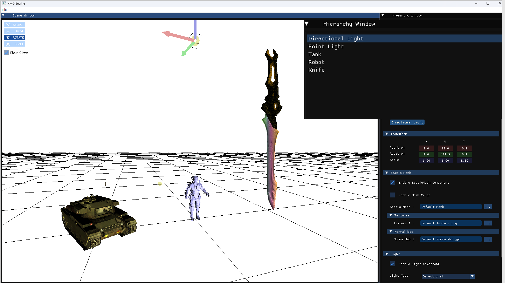
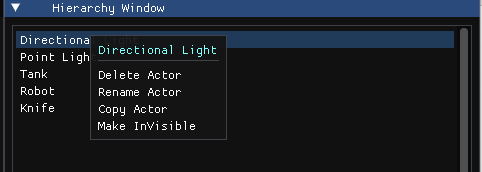
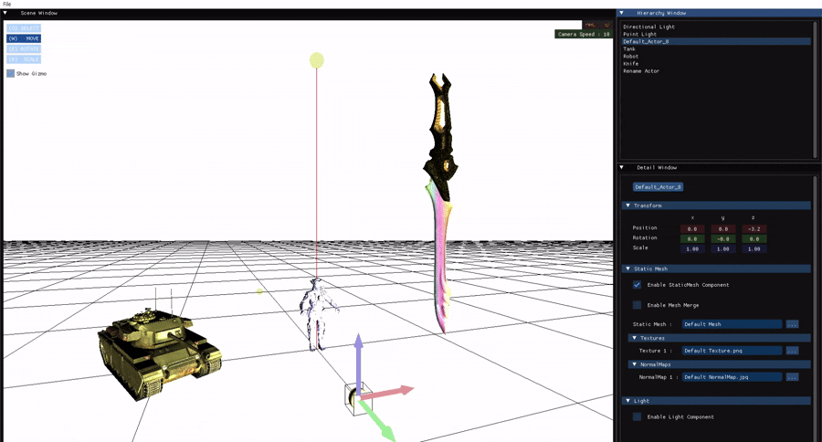
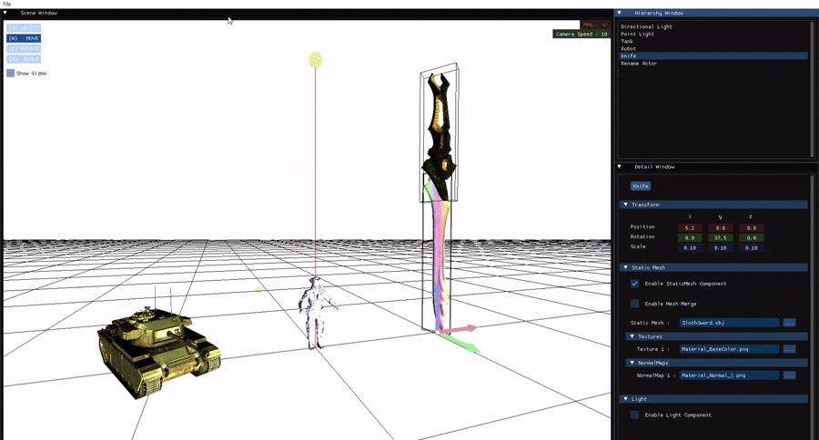
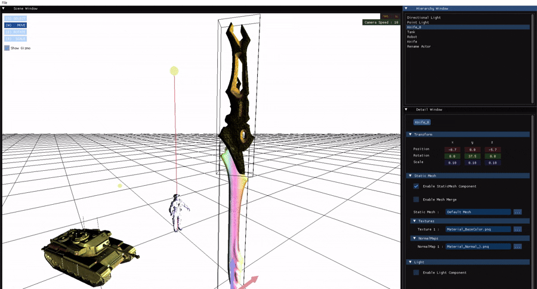
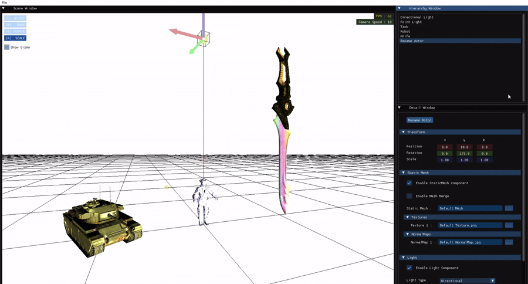

---
## 🧱 0️⃣ Hierarchy Window

`Hierarchy Window`는 현재 **씬(Scene)에 존재하는 모든 액터(Actor)의 목록을 보여주는 창**입니다.  
사용자는 이 창을 통해 액터의 선택뿐만 아니라, 다양한 조작 기능을 수행할 수 있습니다.

---

### 1️⃣ 액터 위에서 마우스 우클릭 시 제공 기능

액터를 마우스 오른쪽 버튼으로 클릭하면 다음과 같은 기능을 사용할 수 있습니다:

- 🗑️ **Delete Actor**  
- ✏️ **Rename Actor**  
- 🧬 **Copy Actor**  
- 👻 **Invisible Actor (가시성 설정)**

---

#### 🗑️ Delete Actor

선택한 액터를 **씬에서 삭제**할 수 있습니다.  
삭제된 액터는 Hierarchy 창과 씬에서 모두 사라집니다.

---

#### ✏️ Rename Actor

액터의 이름을 변경할 수 있습니다.  
새로운 이름을 입력하고 `Enter` 키를 누르면 적용됩니다.  
> ⚠️ 동일한 이름의 액터로는 변경할 수 없습니다.

---

#### 🧬 Copy Actor

선택한 액터를 **복제**할 수 있습니다.  
복제된 액터는 기존 이름 뒤에 `_1`, `_2`, …와 같은 숫자가 붙습니다.

---

#### 👻 Invisible Actor

액터의 **가시성(Visible 여부)을 토글**할 수 있습니다.  
- 숨김 처리 시 씬에서 렌더링되지 않으며  
- 다시 활성화하면 원래 위치에 복귀합니다.

---

### 2️⃣ 빈 공간에서 마우스 우클릭 시

빈 영역에서 마우스 오른쪽 버튼을 클릭하면 다음 기능을 사용할 수 있습니다:

#### ➕ Create Actor

새로운 액터를 생성할 수 있습니다.  
생성된 액터는 디폴트 이름으로 자동 등록되며, 이후 이름 변경이 가능합니다.

---

