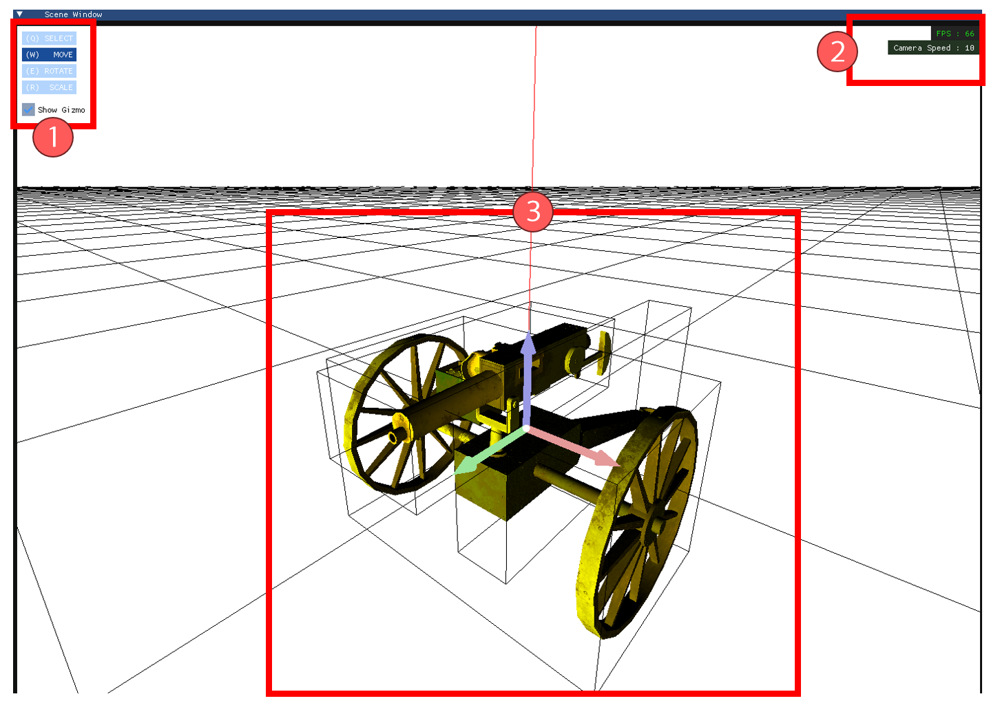
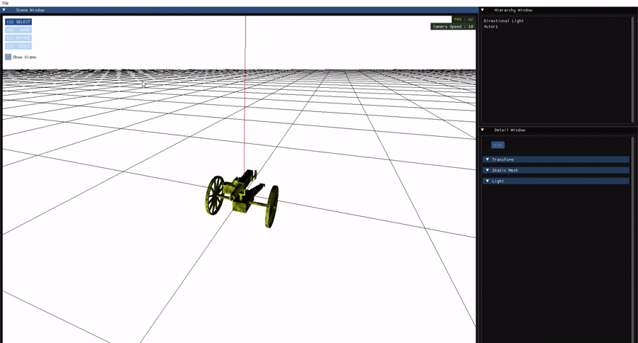
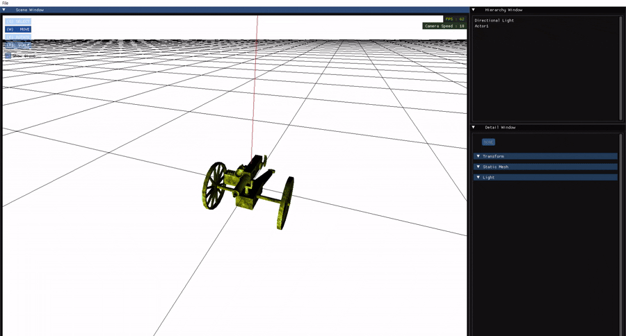
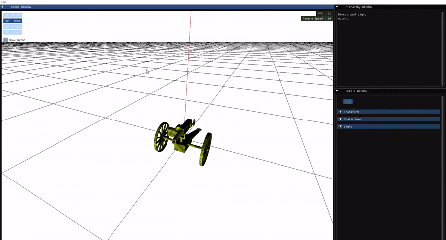
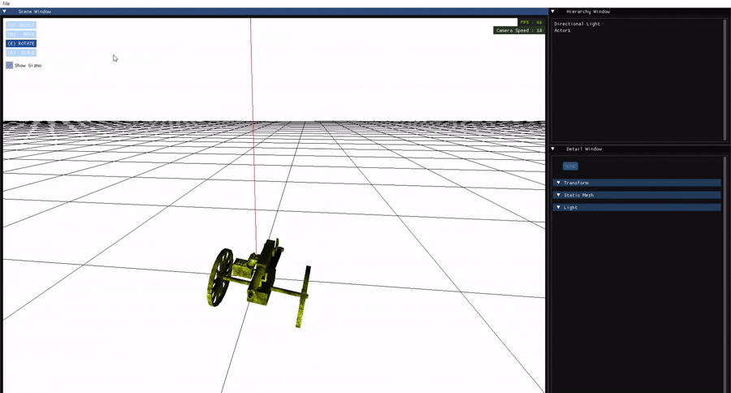
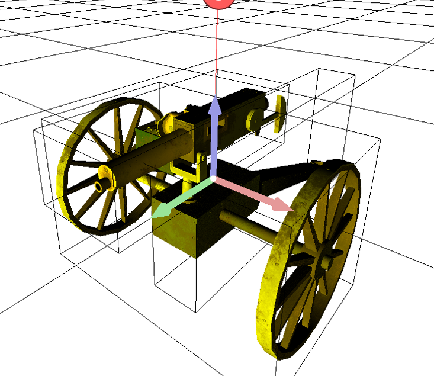
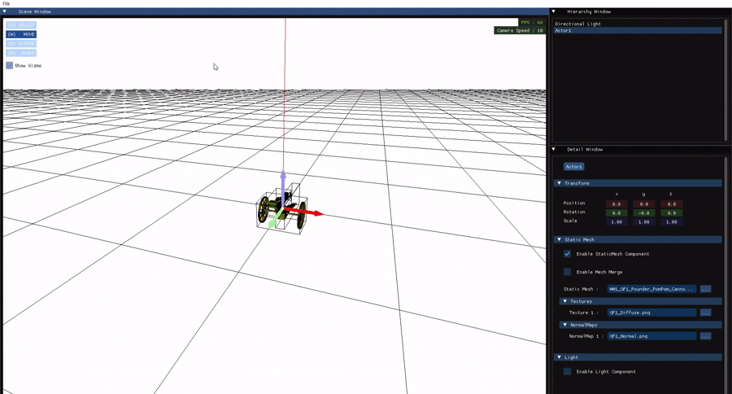
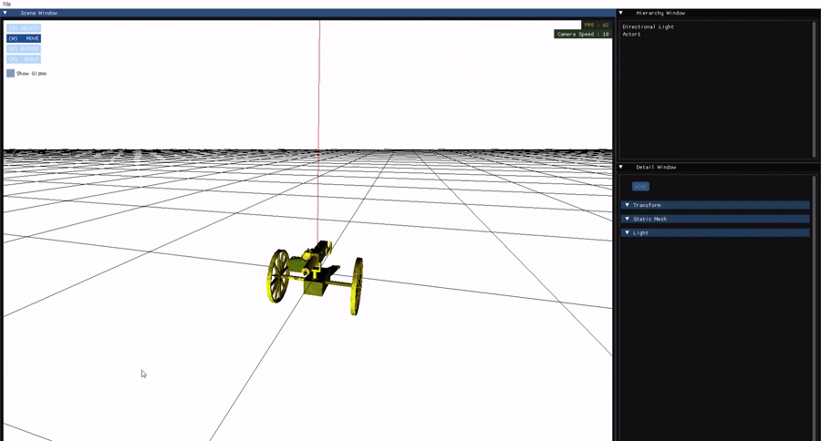

---
## 🪟 기본 창 소개

`Scene Window`에서는 **씬을 자유롭게 탐색하고, 액터를 선택 및 조작**할 수 있는 다양한 기능들을 제공합니다.

---

### 0️⃣ 카메라 이동 및 회전 조작

기본적으로 **언리얼 엔진의 씬 이동 방식**을 따릅니다.  
먼저 **마우스 우클릭을 누른 상태**에서 조작을 시작합니다.

- `WASD` 키: 전진, 좌측, 후진, 우측 이동  
- `Q / E` 키: 하강 / 상승  
- 마우스 이동: 시점(카메라 방향) 회전  
- 마우스 휠 드래그: **카메라 속도 조절**

---

### 1️⃣ Scene Mode (조작 모드)

씬에서 액터를 조작하는 **4가지 모드**가 존재합니다:

| 모드 이름 | 키보드 단축키 | 설명 |
|----------|----------------|------|
| **Select** | `Q` | 액터 선택만 가능. 3D Axis는 표시되지 않으며, 메시의 선택 영역(디버그 박스)만 표시됩니다. |
| **Move**   | `W` | 액터 이동 가능. 3D Axis와 디버그 박스 표시. 축을 클릭 후 드래그하여 이동. |
| **Rotate** | `E` | 액터 회전 가능. 3D Axis를 클릭하고 드래그하여 회전. |
| **Scale**  | `R` | 액터 스케일 조정 가능. 축을 따라 크기 증가/감소 가능. |

#### ▶ 예시 이미지:

- 
- 
- 
- 

---

### 2️⃣ Scene 정보 HUD

- **FPS**: 씬 렌더링 간 시간 차이를 바탕으로 프레임 수치를 표시합니다.  
  - `60FPS` 이상: 녹색 (안정적)  
  - `30FPS` 이하: 빨간색 (성능 저하)
  
- **Camera Speed**: 카메라의 이동 속도 수치를 표시합니다.  
  마우스 우클릭 상태에서 휠을 드래그하면 속도를 조절할 수 있습니다.

---

### 3️⃣ Selected Actor (선택된 액터)

액터를 선택하면 해당 액터의 메시마다 **디버그 박스**가 나타나며, 선택 가능한 영역을 시각적으로 표시합니다.

**Select 모드 이외**의 상태에서는 **3D Axis Gizmo**가 자동으로 표시됩니다.

#### ▶ 3D Axis 예시:
  

- Axis는 **항상 액터 중심**에 위치하며,  
  **카메라 거리와 관계없이 일정한 크기를 유지**하여 조작 편의성을 제공합니다.
  
- 축 위에 마우스를 올리면 **하이라이트**가 발생하며,  
  클릭 후 드래그 시 해당 축 방향으로 **이동, 회전, 스케일 조정**이 이루어집니다.

- 마우스 드래그 시 **축 방향 벡터와의 내적(dot product)**을 기반으로 이동량이 계산되어,  
  마우스 방향에 상관없이 정확한 축 방향 조작이 가능합니다.

---
