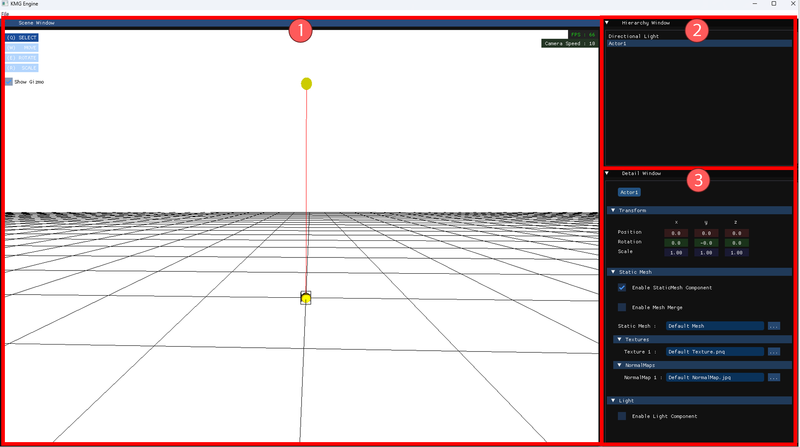
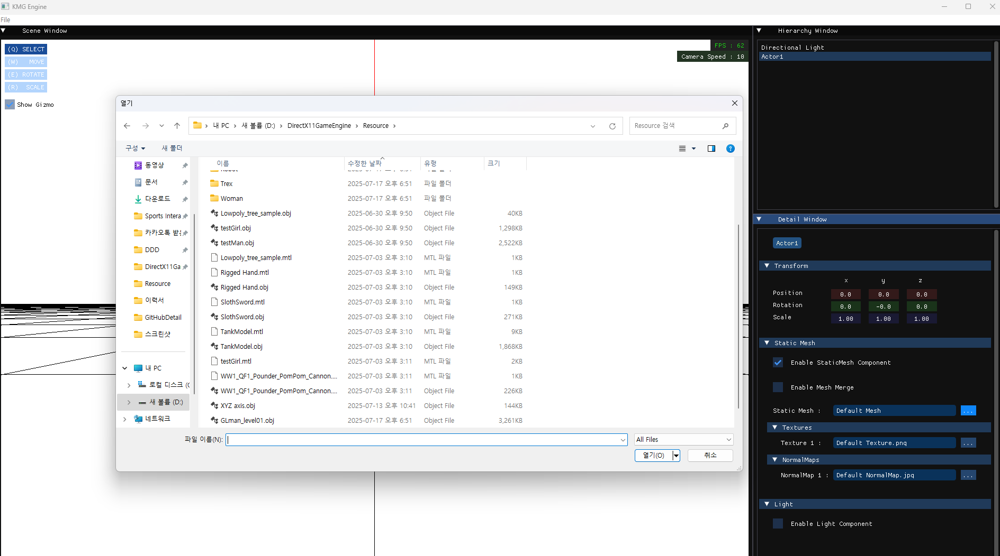

---
## 🪟 기본 창 소개

에디터는 총 세 개의 주요 창으로 구성되어 있으며, 각각의 창은 씬 구성 및 액터 조작에 핵심적인 역할을 합니다.

---

### 1️⃣ Scene Window

에디팅 중인 **씬(Scene)을 직접 보고 조작할 수 있는 창**입니다.

- 액터 선택, 이동, 회전, 배치 등의 편집 기능 제공  
- 선택한 액터는 자동으로 **주목(포커스)** 처리되며  
  → **Detail Window**에서 해당 액터의 세부 정보를 확인 및 수정할 수 있습니다.

🔹 [Scene Window 더 자세히 알아보기](SceneTutorial.md)

---

### 2️⃣ Hierarchy Window

현재 씬에 배치된 **모든 액터들의 계층 구조를 확인**할 수 있는 창입니다.

- 액터 클릭 시 포커스 처리 가능
- 다음과 같은 기능 제공:
  - 액터 이름 변경
  - 액터 삭제 및 복제
  - 액터 생성
  - 액터의 가시성 변경

🔹 [Hierarchy Window 더 자세히 알아보기](HierarchyTutorial.md)

---

### 3️⃣ Detail Window

현재 **주목 중인 액터의 세부 정보**를 조회 및 수정할 수 있는 창입니다.

- `Transform` 정보 (위치, 회전, 스케일) 조회 및 변경
- 해당 액터가 보유한 **Component**들의 상세 속성 표시 및 수정 가능

🔹 [Detail Window 더 자세히 알아보기](Architecture.md)

---

## 📦 메시 로딩 시 주의사항

모델(.obj 등)을 불러올 때, 기본적으로 **절대 경로 기준**으로 메시와 텍스처 파일을 로드합니다.  
따라서 단순한 메시나 텍스처 로딩은 문제가 없지만, 메시 내부에 텍스처 경로가 **내장**되어 있는 경우 주의가 필요합니다.

### ✅ 텍스처 경로 매핑 규칙

- 메시 로딩 시, 해당 메시가 참조하는 텍스처는  
  **반드시 메시 파일과 동일한 폴더 내부의 `Texture/` 서브폴더에 위치**해야 합니다.
  
이 구조를 지키면, 메시 내부의 텍스처 참조 경로가 올바르게 작동하여  
**텍스처가 자동으로 로딩됩니다.**

---
