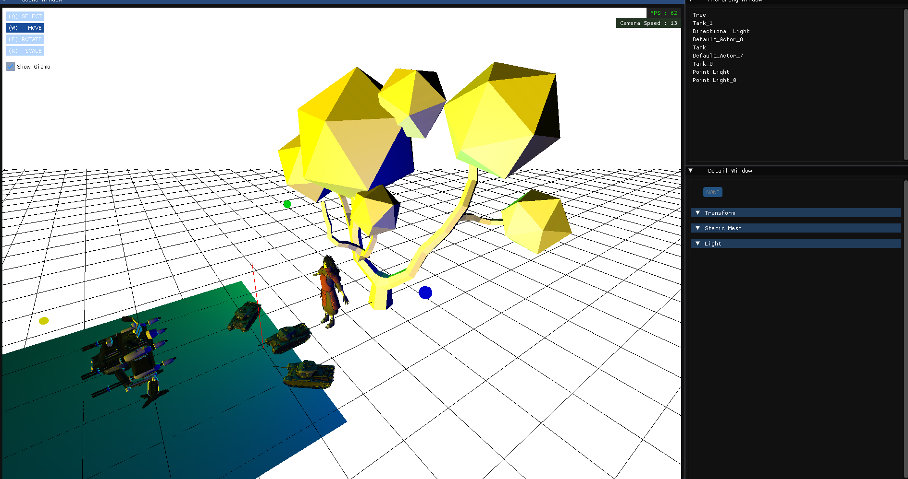
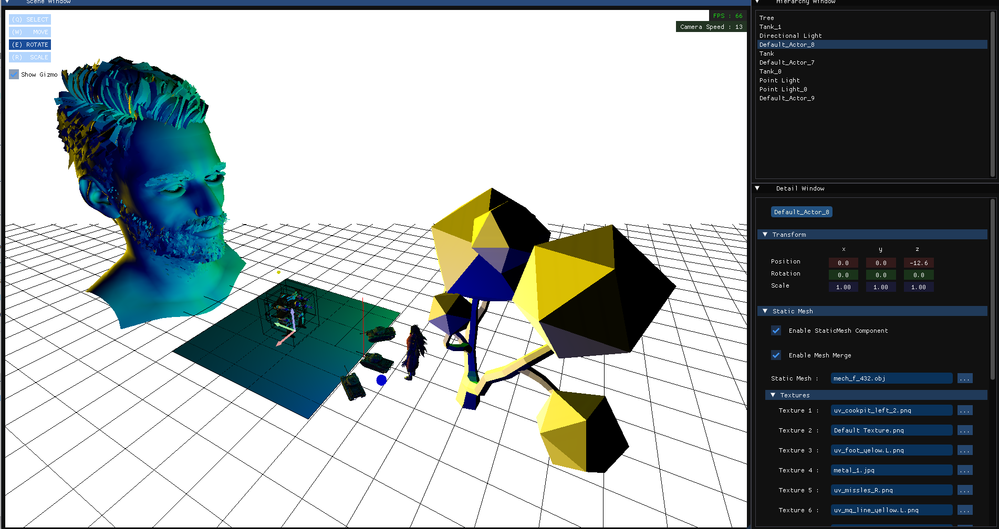
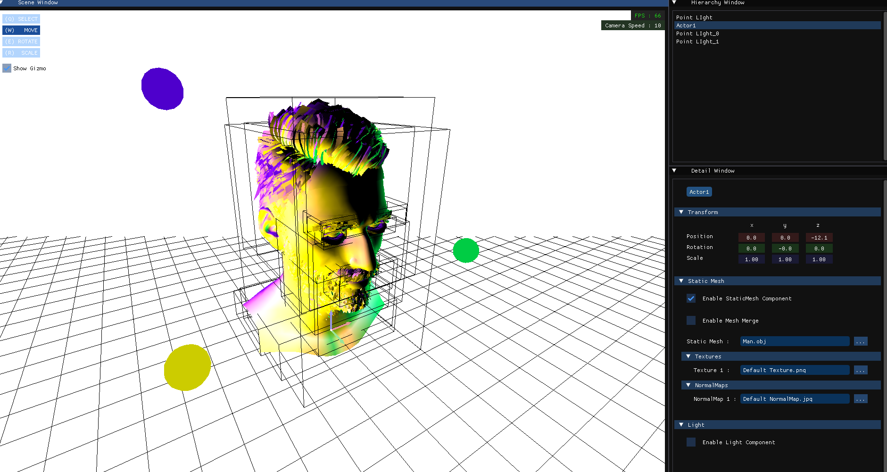

# 🎮 DirectX11GameEngine

**DirectX11**, **Win32 API**, **Dear ImGui**를 활용해 제작한 커스텀 게임 엔진입니다.

## 📌 프로젝트 소개

이 프로젝트는 로우레벨부터 직접 구현한 게임 엔진으로, 다음과 같은 핵심 시스템을 포함합니다:

- 🔧 DirectX11 기반의 커스텀 렌더러
- 🧱 Win32 API를 이용한 윈도우 및 입력 처리
- 🖱️ 디버그 및 에디터용 UI 구현 (Dear ImGui 사용)
- 🧩 향후 확장 가능한 모듈형 구조 설계

## 🛠️ 사용 기술

- **그래픽스 API**: DirectX11  
- **플랫폼 레이어**: Win32 API  
- **UI 디버깅 도구**: Dear ImGui  

## 📆 개발 기간

- **렌더러부터 에디터까지 구현**  
  ⏰ *2025년 6월 21일 ~ 2025년 7월 15일*
